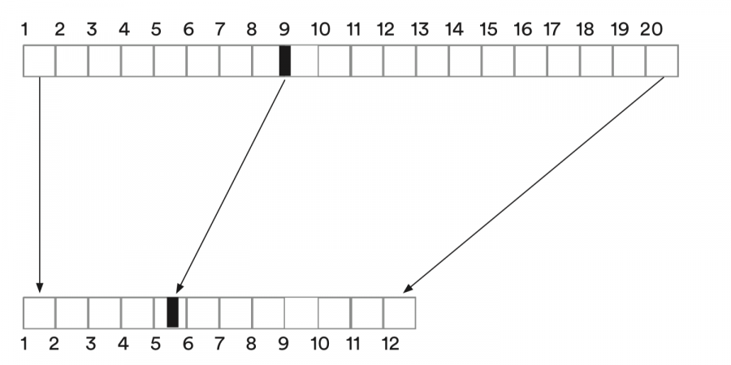

# Interaktionen und Veränderung eines Wertebereichs mit der Funktion map
Gestern haben wir bereits die Systemvariable `mouseX, mouseY` kennengelernt, die uns die aktuelle Position der Maus angeben.
Heute möchten wir `mouseX, mouseY` dafür benutzen, unsere Sketches etwas interaktiver zu gestalten. Sie sollen sich verändern, je nachdem wo die Mausposition liegt. 
[Beispiel ](https://editor.p5js.org/hzuellig/sketches/jyYpde2JK) 
Das einfache Beispiel benutzt die `mouseX` Position als Farbwert. 
`background(mouseX);` 
Ihr seht, die Mausposition kann man inhaltlich auch für etwas anderes als für Position verwenden! 
**Vorausgesetzt, ihr beachtet den Wertebereich der Variablen.**
Was heisst das und wieso funktioniert dieses Beispiel so gut?  

Beachtet die Canvasgrösse im Beispiel. Die ist auf 255 gesetzt. Das heisst, der Wertebereich von mouseX kann von 0-255 gehen. Das passt perfekt zum Wertebereich von schwarz zu weiss, der geht auch von 0-255.  

Was aber, wenn die Canvas zum Beispiel 600 * 600 Pixel gross ist? Dann geht es nicht mehr schön auf mit 0-255.
Im Prinzip könntet ihr ausrechnen, wie das neue Verhältnis sein muss: 0-600 müsste in 0-255 umgerechnet werden. 
Aber es gibt in p5js eine Funktion, die das für uns erledigt. :-)

## Die Funktion map()
Video: https://www.youtube.com/watch?v=nicMAoW6u1g&list=PLRqwX-V7Uu6Zy51Q-x9tMWIv9cueOFTFA   

`map(value, start1, stop1, start2, stop2);` 
Lest einmal in Gruppen die Beschreibung dieser Funktion nach. 
https://p5js.org/reference/#/p5/map 
Versucht gemeinsam herauszufinden, was die 5 Parameter bedeuten. 
Wie müsst ihr die Funktion benutzen, um `mouseX` bei einer Canvasbreite von 600 in einen Wertebereich von 0-255 umzurechnen? 

### Übung 
Macht euch eine Kopie des Beispiels https://editor.p5js.org/hzuellig/sketches/jyYpde2JK und baut es um. Setzt die Canvasgrösse auf 600*600 und benutzt die Funktion `map()`, um die Farben zu berechnen.

### Übung (und Aufgabe)
Inspiration: 
https://uneventfulodyssey.netlify.app/assets/js/p5/sketch-dot/dot.html
Kreiert einen 'Stift', der sich je nach Position in der x und y Achse anders verhaltet. 

