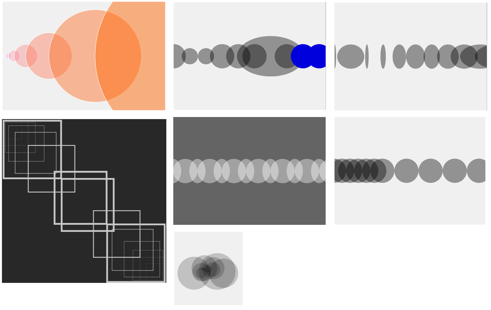

# Variablen im Design und in Code

 <br/>
Ein grosser Reiz von Creative Coding besteht darin, dass Formen parametrisiert werden können. Was heisst das? 
Visuelle Formen haben eine Reihe von Eigenschaften: Strichdicke, Transparenz, Position, Farbwerte, etc. In Creative Coding können diese Aspekte über Variablen abgebildet und variiert werden. 
## Variablen
Was ist eine Variable? Eine Variable ist die Verbindung eines Namens mit einem Wert. Variablen können innerhalb eines einzigen Programms mehrfach verwendet werden. Ihr Wert kann sich während der Ausführung des Programms ändern (oder aber auch konstant bleiben).
### Eine Variablen erstellen und verwenden
Diese Variablen werden zuerst definiert, indem ihr einen Namen festlegt. Den Namen könnt ihr frei wählen, aber er sollte informativ gewählt werden, damit andere Programmiererinnen, die den Code lesen, verstehen, wofür die Variable gebraucht wird. Brauche ich also eine Variable für den Durchmesser von einem Kreis, so nenne ich die Variable `durchmesser`. Für die Deklaration braucht ihr das Schlüsselwort `let` – vollständig ist die Deklaration so
`let durchmesser;` <br/>
Diese Variable ist nun deklariert, aber sie hat noch keinen Wert, sie ist `undefined`. Wenn ihr sie benutzen wollt, so kommt eine Errormeldung. Um sie zu benutzen, müsst ihr also noch einen Wert zuweisen. <br/>
`durchmesser = 30;`<br/>
Die Wertzuweisung erfolgt von rechts nach links. Der Wert rechts vom Gleichheitszeichen steht dann in der Variable, hier wird die 30 in `durchmesser `geschrieben. Hinterher kann ich die Variable (`durchmesser`) wie eine Zahl benutzen.<br/>
Wir haben nun eine Variable deklariert und ihr einen Wert zugewiesen.<br/>
Das lässt sich aber auch in einem einzigen Schritt machen:<br/>
`let durchmesser = 30;`<br/>

Beispiel:
```js
function setup() {
  createCanvas(400, 400);
}

function draw() {
  background(220);
  let durchmesser = 60;
  ellipse(100,50, durchmesser, durchmesser);//durchmesser wird wie eine Zahl benutzt
}
```

### Exkurs
Vielleicht erinnert ihr euch an Platzhalter aus dem Mathematikunterricht: x + 1 = 5; und dann musste man herausfinden, welchen Wert x hat. Es ist wichtig, zu verstehen, dass Variablen in der Programmierung etwas anderes sind! Eine Variable kann ihren Wert ändern! Ihr füllt sie mit einem Wert und diese Füllung könnt ihr laufend ändern. Wenn ich schreibe:<br/>
`let durchmesser = 30;`<br/>
`durchmesser = durchmesser + 30;`<br/>
So etwas wäre in Mathematik Unsinn. In der Programmierung bedeutet es aber, dass der Wert der Variable `durchmesser `hinterher 60 sein wird. Nach Zeile ist ist er 30 (der Wert 30 wird von links nach rechts in die Variable geschrieben). In Zeile 2 werden zum bisherigen Wert (30) nochmals 30 hinzugezählt (=60). Das Resultat dieser Operation wird wieder in die Variable durchmesser links geschrieben. <br/>

### Uebung 
Verändere im obigen Beispiel nach dem ersten Kreis den Wert der Variablen und zeichne einen zweiten neuen Kreis.
```js
  durchmesser = durchmesser / 2; // Der einfache Schrägstrich ist eine Division (Teilung)
  ellipse(100,50, durchmesser, durchmesser);
}
```

## Rechnen mit Variablen
Wir können alle grundlegenden arithmetischen Operationen verwenden:
```js
* Multiplikation
+ Addition
- Subtraktion
/ Division
```

### Uebung 
Betrachtet das Beispiel [Beispiel Variable](https://editor.p5js.org/hzuellig/sketches/5nAuvxsGv) 
* Auf Zeile 10 wird eine Variable deklariert und mit dem Wert 0 befüllt.
* Auf Zeile 13 wird diese Variable a für die x-Koordinaten der Ellipse verwendet.
* Auf Zeile 16 wird 60 hinzugezählt. `a+=60;` ist eine Kurzschreibweise für `a=a+60;`
* Auf Zeile 18 wird diese Variable a für die x-Koordinaten der Ellipse verwendet.
* etc. <br/>

Beachte, dass die Zeichenbefehle immer dieselben sind. Was sich ändert, ist der Wert der Variable. <br/>
Macht eine Kopie dieses Beispiels. Erstellt eine zweite Variable `durchmesser` und verändert sie vor jedem Zeichenschritt. Benutzt die Variable durchmesser statt des fixen Werts 90.<br/>
Baue ein eigenes Beispiel mit Variablen, Parametrisierung und Wiederholung von Formen.<br/><br/>
Zur Inspiration ein paar Resultate aus dem Unterricht, die auf der Basis dieses Beispiels entstanden sind:<br/>
 <br/>

***

# Vorgegebene Variablen p5.js
p5.js stellt euch ein paar Variablen zur Verfügung:
```js
width //breite der aktuellen canvas in px
height //hoehe der aktuellen canvas in px
mouseX //mouseposition x-achse
mouseY //mouseposition y-achse
```
Dieser Sketch zeichnet die Ellipse an aktueller Mausposition:
```js
function setup() {
  createCanvas(400, 400);
  background(240);
}

function draw() {
  ellipse(mouseX, mouseY, 10, 10);
}
```
### Uebung 
Probiert einmal mouseX, mouseY zusätzlich für etwas anderes zu benutzen, für den Durchmesser oder die Farbe.

# Bilder exportieren
Bild über Taste 's' speichern:
```js
function keyReleased() {
    if (key == 's' || key == 'S') {
        let d = new Date();
        let now = d.getFullYear() + "" + (d.getMonth() + 1) + "" + d.getDate() + "" + (d.getHours() + 1) + "-" + (d.getMinutes() + 1) + "" + (d.getSeconds() + 1) + "-" + frameCount;
        saveCanvas(now, 'png');
    }
}
```

*** 
Videos zur Repetition
* Vorgegebene Variablen: https://tinyurl.com/y3m3gokd
* Eigene Variablen: https://tinyurl.com/y2xnkyqt