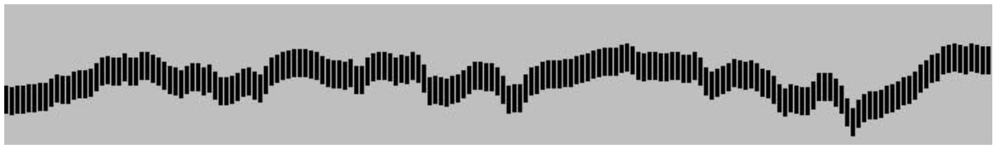

# Programm 16.9.2022

* Schrift einbetten und Styling
* Array 
* Bedingungen
* Zufall, Random


## Schrift einbetten und Styling
Erstellt einen neuen Folder 'tag2' und darin 'ueb1'. Kopiert index.html und sketch.js aus einem anderen Übungsfolder. Im sketch.js startet ihr mit den Basics und der Funktion zum Bilder exportieren:

```js
function setup() {
  createCanvas(windowWidth, windowHeight);//mit den JavaScript Variablen könnt ihr die aktuelle Groesse des Fensters abfragen. 
  
}

function draw() {
}

function keyReleased() {
    if (key == 's' || key == 'S') {
        let d = new Date();
        let now = d.getFullYear() + "" + (d.getMonth() + 1) + "" + d.getDate() + "" + (d.getHours() + 1) + "-" + (d.getMinutes() + 1) + "" + (d.getSeconds() + 1) + "-" + frameCount;
        saveCanvas(now, 'png');
    }
}
```
In der <a href="https://p5js.org/reference/">Referenz</a> im Abschnitt 'Typography' findet ihr die Befehle, um Text zu setzen, zu stylen und die Font zu bestimmen. Ergänzt den Sketch:

```js
let name="Hanna";

text(name, mouseX, mouseY); //in die Funktion draw einfügen
```

Schaut mal die Funktion <a href="https://p5js.org/reference/#/p5/textFont">textFont</a> nach und stylt euren Text mit einer Systemschrift und setzt die Grösse mit <a href="https://p5js.org/reference/#/p5/textSize">textSize</a>. Nehmt die Idee des Stifts auf, der je nach Position unterschiedlich ist und integriert das auf die eine oder andere Weise. Denkt an die Prozessdokumentation, exportiert Momente, die euch visuell interessieren.

## Array
Problemstellung: ich möchte einen Stift generieren, der bei jedem Maus-Klick einen anderen Namen aus der Klasse schreibt. Wie stelle ich dem Programm alle Namen zur Verfügung ohne 13 unterschiedliche Variablen generieren zu müssen? Dafür gibt es eine Datenstruktur, nämlich das Array. Ein Array kann unterschiedliche Werte speichern, sie sind unterschieden durch den Schlüssel, der in eckigen Klammern steht. (Mac Tastatur alt 5 und 6) Die Schlüssel beginnen immer bei 0 zu zählen, nicht bei 1.

```js
let lg_hfiad21 = new Array(); //deklarierung
lg_hfiad21[0] = "Flavia";
lg_hfiad21[1] = "Liza";
lg_hfiad21[2] = "Mirjam";
lg_hfiad21[3] = "Sario";
lg_hfiad21[4] = "Cédric";
lg_hfiad21[5] = "Natascha";
lg_hfiad21[6] = "Noah";
lg_hfiad21[7] = "Alexandra";
lg_hfiad21[8] = "Robin";
lg_hfiad21[9] = "Katrin";
lg_hfiad21[10] = "Juri";
lg_hfiad21[11] = "Melissa";
lg_hfiad21[12] = "Alexandra";
```
Schreibt ihr nun in der draw Funktion 

```js
text(lg_hfiad21[3], mouseX, mouseY); 
```

so schreibt das Programm 'Sario', mit dem Schlüssel 8 'Robin', mit 12 'Alexandra', etc. 

Arrays können auch in einem Schritt deklariert und befüllt werden. Die Schlüssel werden dann automatisch gesetzt, der erste Eintrag hat den Schlüssel 0. 
```js
let lg_hfiad21 = new Array('Flavia','Liza','Mirjam'); 
```

Der Schlüssel kann auch über eine Variable angesprochen werden. 
Das obige Beispiel verändert:
```js
let n=3;
text(lg_hfiad21[n], mouseX, mouseY); 
```

Der Plan ist nun, eine Variable n bei 0 starten zu lassen. Immer wenn der User einen Maus-Klick macht, zählt die Variable um 1 hoch. So wird der nächste Name im Array ausgegeben. Unten findet ihr einzelne Teile des Codes. Probiert einmal zu zweit, das richtig zusammenzufügen.
Weiterführend: Erstelle eine Variable für die Schriftgrösse. Bei jedem Klick soll die Schrift etwas kleiner werden. 

```js
let n=0;//Variable zuoberst ausserhalb von setup
text(lg_hfiad21[n], mouseX, mouseY); 
```

Funktion mouseClicked:

```js
function mouseClicked(event) {
  n=n+1;
  // Kurzschreibweise n++
}
```


## Kontrollstrukturen: Bedingungen
Algorithmen schreiben wäre kein Spass, wenn es keine Kontrollstrukturen gäbe. Das Regelwerk wäre gänzlich unflexibel. Bedingungen sind eine Kontrollstruktur. Bsp.: wenn der Ball aus dem canvas wandert, soll sich seine Bewegung umkehren (Billardkugel). 
Das Schlüsselwort bei Bedinungen ist ```if``` 
In einem Schema wird das so darstellt:<br/>
<br/>
Dabei wird die Test Expression ausgewertet, ist sie 'wahr' (true) wird der 'Body of if' ausgeführt. Falls nicht wird er einfach übersprungen und beim 'Statement just below if' weitergemacht.

Allenfalls gibt es ein ```else```, im Schema:<br/>
<br/>
Dabei wird die Test Expression ausgewertet, ist sie 'wahr' (true) wird der 'Body of if' ausgeführt. Falls nicht wird (anders als oben) in den Ast von 'false' gewechselt und 'Body of else' ausgeführt. Beide Äste vereinen sich dann beim 'Statement just below if'.

Wie sieht das im Code aus? 
Struktur:
```js
//nur if
if(/*hier kommt die Testexpression rein*/){
    /*
    Hier kommt body of if eingerückt, damit man es besser lesen kann
    */
}
/* Hier ist das Statement below if*/


//if und else
if(/*hier kommt die Testexpression rein*/){
    /*
    Hier kommt body of if eingerückt, damit man es besser lesen kann
    */
}else{
    /*
    Hier kommt body of else eingerückt, damit man es besser lesen kann
    */
}
/* Hier ist das Statement below if*/
```

## Entscheidungen: die Test Expression
```js
> // grösser als 
< // kleiner als
>= //grösser oder gleich
<= //kleiner oder gleich
== // genau gleich, zwei Gleichheitszeichen
!= // ungleich
|| // oder
&& // und

let n=3;
if(n<5){
    console.log('Bedingung wahr')
}else{
    console.log('Bedingung falsch')
}

let m=9;
//hier wird jede Bedinung für sich ausgewertet und dann logisch zusammengesetzt
//n<5 -> ist wahr
//m>10 -> ist falsch
// weil die Bedigungen mit && UND zusammengesetzt sind, müssten BEIDE wahr sein, um wahr zu ergeben 
if(n<5 && m>10){ 
    console.log('Bedingung wahr')
}else{
    console.log('Bedingung falsch')
}
``` 

Wir wollen nun im Beispiel mit den Namen eine Bedingung formulieren: falls unsere Variable n grösser wird als die Anzahl der Einträge im Array, soll sie wieder zurück auf 0 gesetzt werden. 
Die Anzahl Einträge in einem Array könnt ihr so abfragen:
```js

console.log(lg_hfiad21.length); // mit 13 Einträgen wird 13 ausgegeben 

//Achtung bei 13 Einträgen geht der Schlüssel bis 12, weil man mit 0 beginnt. n darf nur bis 12 gehen. Deshalb 1 abzählen.

if(n>lg_hfiad21.length - 1){
    n=0;
}

```
Erstellt mal einen Stil wenn die Maus gedrückt ist und einen wenn sie nicht gedrückt ist: https://p5js.org/reference/#/p5/mouseIsPressed

## Codejamming
Lädt euren Code in das Repo https://github.com/hzuellig/sfgz-designandcode/tree/main/Abgaben, erstellt einen neuen Übungsfolder und holt den Code von der Person vor euch im Alphabet, benennt den Folder mit eurem Namen.
Liza -> holt den von Flavia, Folder 'Liza-ueb1'
Mirjam -> holt den von Liza, Folder 'Mirjam-ueb1'
Sario -> holt den von Mirjam, Folder 'Sario-ueb1'
etc.
Flavia -> holt den von Alexandra

Arbeitet nun mit dem Code der anderen Person. Regel: ihr dürft Dinge ändern, ergänzen, aber nicht löschen. Nach 15 Min ladet ihr der Person eure Version ins Repo Tag2 und holt die Version eurer Partnerperson von eurem eigenen Code. Studiert die Änderungen, fragt allenfalls nach und arbeitet nochmals 15 Min darauf basierend weiter. 

## Zufall, Random
https://p5js.org/reference/#/p5/random
Ein Parameter:
```js
let wuerfel=random(50); // die Funktion random gibt hier eine Zahl zwischen 0 (inklusive 0) und 50 (exklusive 50) zurück. Die generierte Zahl ist eine Fliesskommazahl, das heisst, sie hat auch Stellen hinter dem Komma, z.Bsp. 5.76590
```
Zwei Parameter:
```js
let wuerfel=random(20, 50); // die Funktion random gibt hier eine Zahl zwischen 20 (inklusive 20) und 50 (exklusive 50) zurück. Die generierte Zahl ist eine Fliesskommazahl, das heisst, sie hat auch Stellen hinter dem Komma, z.Bsp. 27.38965

```
Ergänzt euren Sketch, jedesmal, wenn geklickt wird, soll eine neue zufällige Farbe generiert werden. 

## Noise
https://p5js.org/reference/#/p5/noise
Wir hatten am Tag 1 von Noise gesprochen, der Algorithmus von Ken Perlin.
Vieles in der Natur ist nicht einer strengen Regelmässigkeit unterworfen, aber die Unterschiede sind auch nicht rein zufällig. Beachtet zum Beispiel die Farben eines Herbstbaumes. Versucht man, mit der random Funktion, Farben zwischen rot und grün zu erzeugen, so ergibt sich kein natürlicher Effekt. Die Farben sind zu zufällig: <a href="https://editor.p5js.org/hzuellig/sketches/rCbhy2W4f">Random Color</a>.
Noise hingegen liefert eine Art strukturierten Zufall. Die generierte Zahl liegt zwischen 0 und 1 (Fliesskommazahl). <br/>
<br/>
Beispiel Grauwerte:
```js
let noiseVal = 2; // der Startwert in der x-Koordinate Abbildung oben
let noiseScale=0.02; // um wieviel der noise Regler in der x-Achse verschoben wird. je grösser, desto unregelmässiger, je kleiner desto sanfter
let grau = noise(noiseVal) * 255; // wird mit 255 multipliziert, damit Werte zwischen 0 und 255 resultieren

fill(grau);

noiseVal = noiseVal + noiseScale; //damit beim nächsten noise ein anderer Wert rauskommt
```

# Videos
* <a href="https://www.youtube.com/watch?v=1Osb_iGDdjk&list=PLRqwX-V7Uu6Zy51Q-x9tMWIv9cueOFTFA&index=14">Bedingungen</a>
* <a href="https://www.youtube.com/watch?v=VIQoUghHSxU&list=PLRqwX-V7Uu6Zy51Q-x9tMWIv9cueOFTFA&index=27">Arrays</a>
* <a href="https://www.youtube.com/watch?v=POn4cZ0jL-o&list=PLRqwX-V7Uu6Zy51Q-x9tMWIv9cueOFTFA&index=11">Zufall</a>