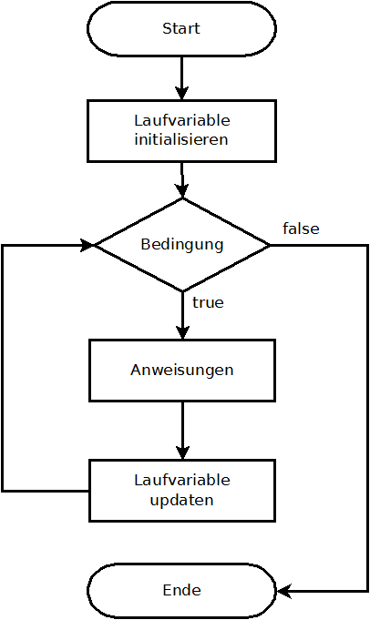

# Programm 17.9.2022

* Schleifen 
* JSON Datenformat
* JSON einlesen

## Schleifen (Iteration)
Erstellt einen neuen Folder 'tag3' und darin 'ueb1'. Kopiert index.html und sketch.js aus einem anderen Übungsfolder. Im sketch.js startet ihr mit den Basics und der Funktion zum Bilder exportieren. Fügt das Namensarray von gestern als globales Arry zuoberst ausserhalb der Funktionen ein. 

```js
function setup() {
  createCanvas(windowWidth, windowHeight);//mit den JavaScript Variablen könnt ihr die aktuelle Groesse des Fensters abfragen. 
  
}

function draw() {
}

function keyReleased() {
    if (key == 's' || key == 'S') {
        let d = new Date();
        let now = d.getFullYear() + "" + (d.getMonth() + 1) + "" + d.getDate() + "" + (d.getHours() + 1) + "-" + (d.getMinutes() + 1) + "" + (d.getSeconds() + 1) + "-" + frameCount;
        saveCanvas(now, 'png');
    }
}
```
Schleifen (Iterationen) sind eine super Kontrollstruktur, um den Computer eine Sache immer und immer wieder auszuführen. Iterative Strukturen werden verwendet, um lange, sich wiederholende Codezeilen zu verdichten. Die Verringerung der
der Länge des Codes können Programme leichter verwaltet werden und helfen auch bei der
Fehler zu reduzieren. Die folgende Uebersicht zeigt gleichwertige Programme, die ohne iterative Struktur und mit einer for-Struktur geschrieben wurden. Die ursprünglichen 13 Codezeilen oben werden auf die 3 Zeilen unten reduziert:

```js
line(20, 20, 20, 180);
line(30, 20, 30, 180);
line(40, 20, 40, 180);
line(50, 20, 50, 180);
line(60, 20, 60, 180);
line(70, 20, 70, 180);
line(80, 20, 80, 180);
line(90, 20, 90, 180);
line(100, 20, 100, 180);
line(110, 20, 110, 180);
line(120, 20, 120, 180);
line(130, 20, 130, 180);
line(140, 20, 140, 180);
```

Mit Iteration:

```js
for (let i = 20; i < 150; i += 10) {
  line(i, 20, i, 180);
}
```
In einem generellen Schema wird die Iteration so dargestellt: <br/>
<br/>

* Angabe: wo beginnst du zu zählen? Initialisierung der Laufvariable.
* Angabe: wann hörst du auf? Durchlauf-Bedingung
* Angabe: um wieviel erhöhst du bei jedem Schritt? Laufvariable updaten

In Pseudocode:
```js
for (init; test; update) {
// Teil der Schleife
}
```

Um alle Namen aus dem Array (Tag 2) auszugeben, sähe das in einem konkreten Beispiel so aus:
init -> unser Arrayzähler startet bei 0, wenn wir von Anfang an alle ausgeben möchten heisst das, wir setzen die Laufzeitvariable auf 0.

```js
//für init
let n=0;
```

Die Durchlaufbedingung ist die Länge des Arrays. Wenn alle Einträge ausgegeben sind, soll die Schleife stoppen. 

```js
//für test
n < lg_hfiad21.length
```

Bei jedem Durchlauf soll der Zähler um 1 hochgezählt werden.

```js
//für update
n++
```

Zusammengesetzt ergibt das:

```js
for (let n = 0;  n < lg_hfiad21.length; n++) {
  text(lg_hfiad21[n], 20, 20 * n); 
}
```
## JSON Format (Datenstruktur)

Du kannst dir ein JSON als eine Möglichkeit vorstellen, eine komplexe Variable mit mehreren Dimensionen zu beschreiben. Zum Beispiel die Position eines Objekts im Raum, definiert durch x und y. 

```js
let position = {
  x: 145,
  y: 765,
  b:'s'
};

//für die Ausgabe von x
console.log(position.x);
```
Ein JSON kann auch Arrays beinhalten:

```js
let user ={
    age: 34,
    sex: 'f',
    wohnorte: ['Bülach', 'Hastings', 'Zürich', 'London']
}

//für die Ausgabe eines Wohnorts

console.log(user.wohnorte[1])

```
Damit kennst du die Strukur des JSON Formats! 
JSON können beliebig tief sein. Rufe einmal diese URL auf: https://earthquake.usgs.gov/earthquakes/feed/v1.0/summary/all_day.geojson 
Mit der Chrome Erweiterung https://chrome.google.com/webstore/detail/json-formatter/gpmodmeblccallcadopbcoeoejepgpnb/related 
kannst du alle Ebenen ein- und ausklappen und die Struktur kennenlernen. 


## JSON generieren und speichern

```js
let tracks = new Array();//hier speichern wir die Mausbewegung
let max = 100; // eine maximal Begrenzung von Positionen 


function setup() {
    createCanvas(window.innerWidth, window.innerHeight);
    background(0);
    frameRate(5);//frameRate verlangsamen
}
function draw() {
    ellipse(mouseX, mouseY, 10, 10);

    let letter = sentence.charAt(zaehler);
    zaehler++;

    let object = { x: mouseX, y: mouseY };
    tracks.push(object); //mit push kann ein array mit einem neuen eintrag ergänzt werden.

    if (tracks.length > max) { //damit nicht unendlich daten gesammelt werden
        console.log('array is filled up')
        saveJSON(tracks, 'tracks.json');
        noLoop();
    }
}

//Ergibt ein File mit der folgenden Struktur:
[
  {
    "x": 484,
    "y": 467
  },
  {
    "x": 558,
    "y": 473
  },
  {
    "x": 558,
    "y": 473
  }
]
```
## JSON einlesen 
https://p5js.org/reference/#/p5/loadJSON <br/>
Nun können wir umgekehrt das File wieder einlesen
```js
let tracks = new Array();//hier schreiben wir die gespeicherten mausbewegungen rein
function preload() {

    let url = 'tracks.json'; //achtung, eventuell pfad anpassen!
    loadJSON(url, loaded); //die funktion loaded wird aufgerufen, wenn das file fertig geladen ist (callback funktion)
}

function loaded(data) {
    tracks = data;
    //console.log(tracks);
}

```

Somit sind die Daten eingelesen und im Array tracks. Testen kannst du das mit console.log(tracks)
Nun wollen wir die eingelesenen Spuren in der draw Funktion ausgeben, dafür benutzen wir einen Zähler n. In jedem frame wird der nächste Eintrag ausgelesen:

```js

let n=0;
function draw() {
    if (tracks.length > 0) {
        text("Hanna", tracks[n].x, tracks[n].y);
        n++;

        if (n > tracks.length - 1) {
            noLoop();
        }
    }

}
```
Versuche mal, die Idee der Spur in die Visualisierung einzubringen – mit dem, was du gelernt hast. Z.Bsp. die Textfarbe verblassen lassen, oder die Grösse über die Zeit verändern, etc. etc.

## Browser History

Aufgabe: 
Lest eure Browser History ein und gebt mal alle Seitentitel aus. 
Auf kommenden Samstag, 3 Varianten der Visualisierung erstellen, indem du Konzepte, die du jetzt gelernt hast, kombinierst. <br/>
Schaut je nach Bedarf die untenstehenden Videos zur Repetition. <br/>
*** 
Videos zur Repetition
* <a href="https://www.youtube.com/watch?v=_NFkzw6oFtQ">JSON</a> 
* <a href="https://www.youtube.com/watch?v=cnRD9o6odjk">Schleifen</a>